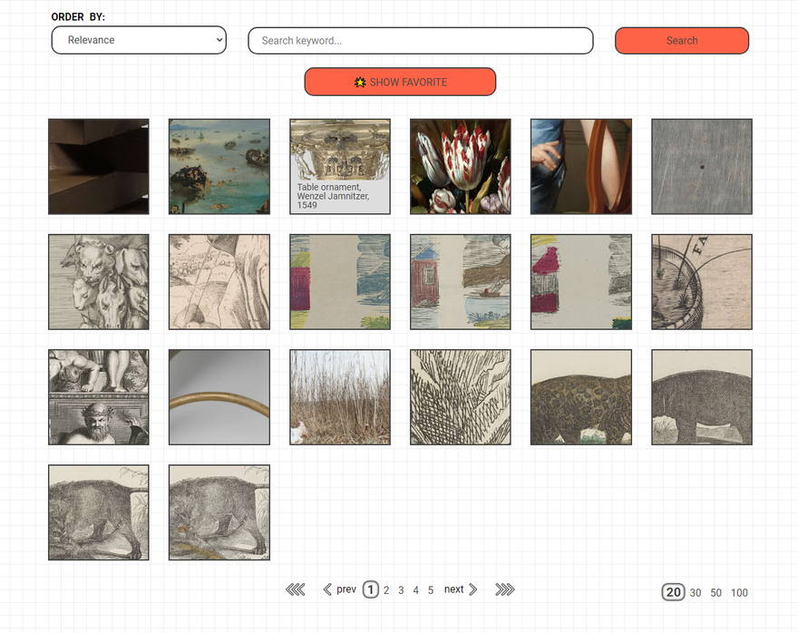

# Application for Rijksmuseum 

    

##### This is a test project, the essence of which is to give the user the opportunity to comfortably view basic information about the objects of art (paintings) of the Rijksmuseum. The app supports full-text search by title, artist name, object type (painting, drawing, print…) and century filter.

##### Let's see this project in work — [http://yevhenii.website/](http://yevhenii.website/)

The data comes from Rijksmuseum's official Linked Data platform (https://data.rijksmuseum.nl).

The project uses three APIs:
1. **Search API** — `https://data.rijksmuseum.nl/search/collection` — returns Linked Open Data identifiers (no images, no titles directly).
2. **Linked Data Resolver** — `https://data.rijksmuseum.nl/{id}` — resolves an identifier into Linked Art JSON (`HumanMadeObject` → `VisualItem` → `DigitalObject`).
3. **IIIF Image API** — `https://iiif.micr.io/{id}/full/{w},/0/default.jpg` — actual image bytes, served by Micrio.

No API key is required. See `docs/plans/renovate_api_architecture.md` for the migration history (the original 2023 REST API at `rijksmuseum.nl/api/en/collection` was discontinued — it returns 410 Gone).

The project was built on the Angular 9 framework **without using** third-party libraries, frameworks, etc. (to optimize web application loading).

#### The project consists of:
##### 4 components:
* main.component
* popup.component
* details.component
* error-page.component
###### Each component represents a separate page for rendering information
##### Services:
* data.service — facade over the API layer; holds collection / details / favorites state.
* pagination.service — token-based pagination (100 items/page, prev/next only).
* api/rijks-linked-art.client — low-level HTTP client for `data.rijksmuseum.nl`.
* api/linked-art.adapter — converts Linked Art JSON into the flat `IArtObject` / `IArtObjectDetails` shapes.
* api/image-loader.service — lazy IIIF URL resolution with per-(id, width) Observable cache.
##### 3 directives:
* ng-for-with-numbers.directive (loading skeleton)
* image-scale.directive
* ref.directive
##### Internal interfaces:
* iart-collection
* iart-object
* iart-object-details
* iart-object-image
* ipaginator-settings
* api/linked-art-types
###### The assets folder contain only a few pictures (icons)
###### Also, all the style variables were moved to a separate file (`src / stylings`). This file was connected to the
 project through the configuration file (<u>*`angular.json: `*</u>`projects / Rijksmuseum / architect / build / options / stylePreprocessorOptions / includePaths`)
***

### Visit The Rijksmuseum

> Official site of Rijksmuseum — https://www.rijksmuseum.nl/en

> About Rijksmuseum data— https://www.rijksmuseum.nl/en/data
>
> API documentation — https://data.rijksmuseum.nl/docs/

> MyAccount in Rijksmuseum — https://www.rijksmuseum.nl/en/rijksstudio/2826853--renjeka/collections

***

### Troubleshooting

#### `ERR_OSSL_EVP_UNSUPPORTED` on `npm start` / `npm run build`

**Symptom:** Build fails with `error:0308010C:digital envelope routines::unsupported`.

**Cause:** Angular 9 uses webpack 4, which relies on the MD4 hashing algorithm. Node.js 17+ ships with OpenSSL 3, where MD4 is no longer supported by default.

**Fix (already applied):** `NODE_OPTIONS=--openssl-legacy-provider` is set inside each npm script in `package.json`. This enables the legacy OpenSSL provider for the build process only and requires no changes to the Node.js installation.

> Note: this flag is not supported on Windows CMD/PowerShell without `cross-env`. If developing on Windows, install `cross-env` and prefix each script with `cross-env NODE_OPTIONS=...`.

